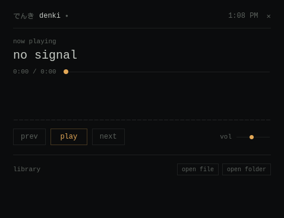
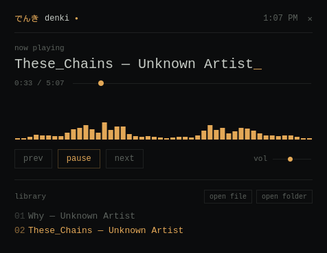

# Denki

Denki is a compact desktop music player for listening to local audio files. It pairs a minimal interface with a CAVA-inspired stereo spectrum visualizer.

**[Download Denki](https://github.com/ZahaSanko001/Denki/releases/latest)**

## Screenshots





## Features

- Play audio files or scan a folder and its subfolders.
- Browse tracks and control playback, seeking, and volume.
- View a stereo spectrum visualizer inspired by CAVA.
- Restore the last library, track, playback position, and volume when you reopen the app.
- Use system media controls where supported.

Supported audio formats: MP3, FLAC, WAV, OGG, M4A, and AAC.

## Install

Open the [latest GitHub release](https://github.com/ZahaSanko001/Denki/releases/latest) and download the installer for your operating system.

### Windows

Download the `*-setup.exe` installer, run it, and follow the prompts.

### Fedora

Download the `.rpm` package, then install it from a terminal:

```bash
sudo dnf install ./Denki-*.rpm
```

### Debian or Ubuntu

Download the `.deb` package, then install it from a terminal:

```bash
sudo apt install ./Denki_*_amd64.deb
```

### Other Linux distributions

Download the `.AppImage`, make it executable, and launch it:

```bash
chmod +x ./Denki_*.AppImage
./Denki_*.AppImage
```

## Use Denki

Select **open file** to add a single audio file, or **open folder** to scan a music folder and its subfolders. Select a track in the library to play it.

| Key | Action |
| --- | --- |
| Space | Play or pause |
| Left arrow | Previous track |
| Right arrow | Next track |

## Build from source

Install Rust stable, the Tauri CLI, and your platform's native prerequisites. See the [Tauri v2 prerequisites](https://v2.tauri.app/start/prerequisites/) for platform-specific setup. Denki uses a vanilla JavaScript frontend and does not require Node.js or a JavaScript package manager to build.

```bash
cargo install tauri-cli --version '^2'
cargo tauri dev
```

To create release bundles for your current operating system:

```bash
cargo tauri build
```

## License

Denki is licensed under **GPL-3.0-only**. See [COPYING](COPYING) for the full license text.
